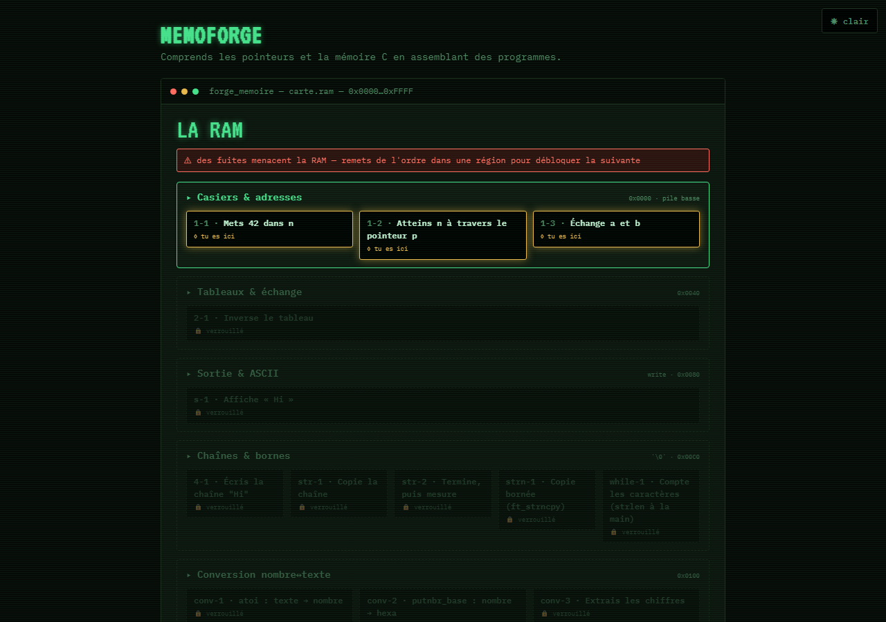
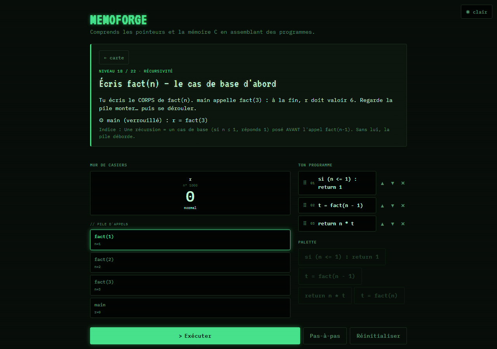

<div align="center">

# MemoForge

**Comprends les pointeurs et la mémoire C — en assemblant des programmes qui s'exécutent vraiment.**

[](https://github.com/decarvalhoe/MemoForge/actions/workflows/ci.yml)
[](https://github.com/decarvalhoe/MemoForge/actions/workflows/deploy.yml)


### [▶ Jouer / Play now](https://decarvalhoe.github.io/MemoForge/) · FR / EN

*Jeu de puzzle web pour la Piscine C de l'École 42 — vanilla JS, 130 KB, aucune installation.*



</div>

---

## L'idée

Les pointeurs ne s'apprennent pas en lisant — ils s'apprennent en **voyant la mémoire
réagir**. Dans MemoForge, la carte du jeu *est* la RAM. Tu entres dans une salle, tu
assembles un programme avec des briques d'instructions C, tu l'exécutes **pas à pas** :
les casiers changent, le fil pointeur se trace, le tas s'alloue et se libère, **la pile
d'appels monte et se déroule sous tes yeux**.

Le principe fondateur : **la machine est vraie**. Le jeu ne simule pas le C — il
l'exécute. Chaque bloc posé est interprété par un vrai moteur mémoire ; chaque pixel à
l'écran est la projection d'un état réel. Et chaque *crash* est un professeur : déréférencer
NULL, oublier `free`, libérer un maillon encore chaîné, ou récurser sans cas de base —
le piège célèbre devient un moment de jeu, expliqué dans les termes de l'anti-sèche.

<div align="center">


*Monde 6 — tu écris le corps de `fact(n)` ; la pile d'appels à l'écran est la conséquence
réelle de ton code. Oublie le cas de base… et regarde-la déborder.*
</div>

## Ce que tu y travailles

MemoForge suit le **cours mémoire M1→M12** et les **exercices officiels de 42**, dans
l'**esprit libft** : les `ft_` qu'on utilise, on les **écrit soi-même**. Tu n'as jamais un
bloc `strcpy` tout fait — tu assembles son corps à partir des primitives, et une fois forgée,
la fonction entre dans **ta libft** et resert (ton `ft_strdup` appelle **ton** `ft_strlen`).
**44 niveaux** sur la carte de la RAM ([`docs/BRIQUES.md`](docs/BRIQUES.md)) :

| Concept (cours) | Ce que tu écris depuis zéro |
|---|---|
| M4 pointeurs | `ft_ft`, `ft_swap`, `ft_div_mod` — modifier l'appelant **par adresse** (pas par copie) |
| M5/M6 la pile | `ft_ultimate_ft` (peler les étoiles) · **dangling pointer** : `return &x` meurt, d'où le tas |
| M10 chaînes | `ft_strlen → ft_strcpy → ft_strdup`, `ft_atoi` (chaîne de forge, `c - '0'`) |
| M7/M9 le tas | `malloc`/`free`, `ft_range`, **`ft_split` N+1 free** — verdict **façon valgrind** |
| M11 tableaux | `ft_rev_int_tab` (`tab[i] ≡ *(tab+i)`), `ft_range` dynamique |
| M12 listes | `->next`, le vrai **use-after-free** (libère en sauvant `->next`) |
| M1/M2 les octets | **explorateur d'octets** : `1000 → e8 03 00 00` little-endian |

Autour des niveaux : **médailles d'optimisation** (≤ N instructions · pas · casiers),
**bac à sable** (provoque une fuite, un double free, un déréf. NULL — librement),
**mode examen** (chrono, sans indice, score). Les indices ne donnent **jamais** la réponse
(règle du cours, garde automatisée) : ils posent une question ou renvoient au modèle. Thème
clair/sombre, contraste WCAG AA vérifié par test.

## Jouer

**En ligne** : <https://decarvalhoe.github.io/MemoForge/> — déployé en continu depuis `main`.

**En local** (les modules ES exigent un serveur HTTP) :

```bash
git clone https://github.com/decarvalhoe/MemoForge && cd MemoForge
npm run serve        # python -m http.server 8000
# → http://localhost:8000
```

Aucun build requis pour jouer : le jeu est du **vanilla JS, zéro dépendance runtime**.

## Architecture

Trois couches indépendantes — **le moteur ne connaît pas l'UI** :

```
src/
├── engine/       LE CŒUR — testable sans navigateur, couvert à 100 %
│   ├── memory.js       casiers, adresses, malloc/free, chaînes, fichiers, nœuds
│   ├── interpreter.js  exécution pas-à-pas : frames d'appel, boucles, if/call/return
│   └── ast.js          le mini-langage unifié (source unique des constructeurs)
├── game/         logique de jeu, sans DOM
│   ├── levels.js world.js medals.js pitfalls.js tracker.js questions.js
│   └── game.js         contrôleur : carte / salle / bac à sable / examen
└── ui/           vues + design-system « Phosphore » (components/, *View.js, theme.js)
```

Les choix de game design (pourquoi chaque mécanique a cette forme, le contrat des
niveaux-fonction) sont documentés dans [`docs/GAME-DESIGN.md`](docs/GAME-DESIGN.md).

## Qualité

Chaque PR passe quatre barrières en CI :

| Barrière | Contenu |
|---|---|
| **Tests** | 314 tests `node:test` — moteur, niveaux (chaque appât vérifié comme *enseignant*), monde, médailles, pièges, a11y · **couverture moteur ≥ 90 % exigée (100 % effective)** |
| **Non-régression** | balayage data-driven : chaque niveau doit rester résoluble par son chemin canonique |
| **Écrans clés** | harnais Puppeteer : 4 écrans capturés, invariants structurels + comparaison pixel ([`docs/TESTING.md`](docs/TESTING.md)) |
| **Budgets perf** | poids ≤ 200 KB, rendu ≤ 16 ms — mesurés et appliqués ([`docs/PERF.md`](docs/PERF.md)) |

L'artefact de prod (`npm run build` → `dist/`) est revérifié par le même harnais avant
d'être déployé sur Pages.

```bash
npm test              # tests + couverture (seuil 90 % sur src/engine)
npm run lint          # ESLint — règles inspirées de la Norme 42
npm run test:visual   # écrans clés + budgets perf (Chrome headless)
npm run build         # artefact statique dist/
```

## Documentation

[`BRIQUES.md`](docs/BRIQUES.md) — l'ancrage pédagogique (les 12 briques ↔ modules C00-C13) ·
[`GAME-DESIGN.md`](docs/GAME-DESIGN.md) — principes et mécaniques ·
[`ROADMAP.md`](docs/ROADMAP.md) — feuille de route ·
[`ARCHITECTURE.md`](docs/ARCHITECTURE.md) · [`TESTING.md`](docs/TESTING.md) ·
[`PERF.md`](docs/PERF.md) · [`CHANGELOG.md`](CHANGELOG.md)

## Contribuer

Une issue = une branche = une PR, tests avant merge, changements additifs — les
conventions détaillées sont dans [`docs/COORDINATION.md`](docs/COORDINATION.md).
Étendre le mini-langage : un constructeur dans `ast.js` + sa branche interpréteur + un
test. Ajouter un niveau : des données dans `levels.js` + sa solution canonique dans le
test de non-régression (le test de complétude te le rappellera).
